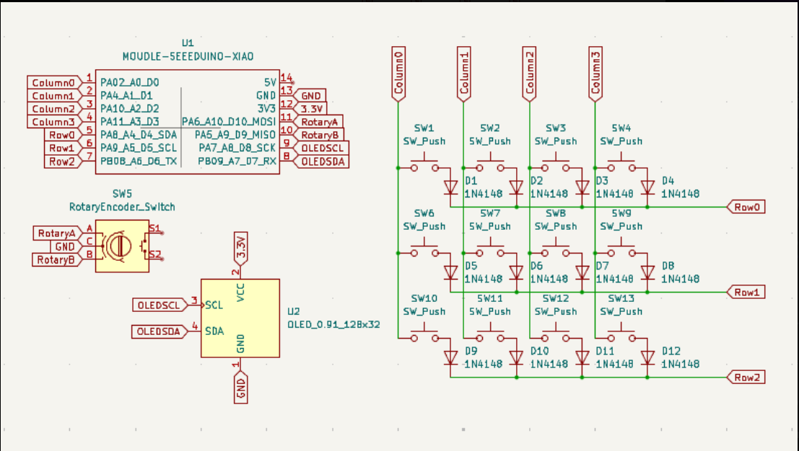
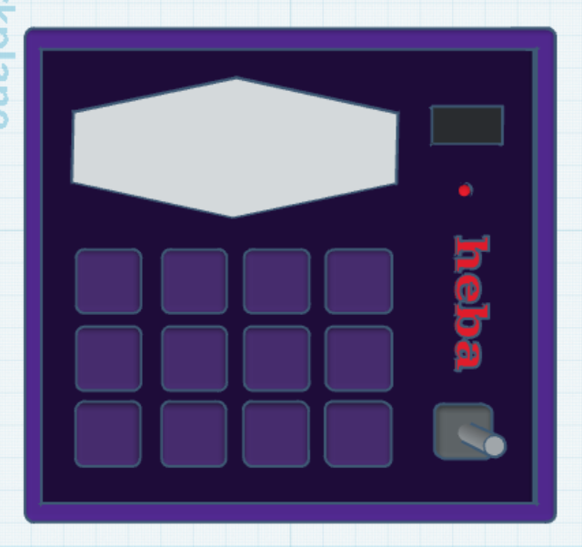

# ShockPad Macropad
This is my submission for HackPad.
It is a 4x3 macropad made using KMK firmware and the Seeed XIAO RP2040.

## Features
* Media Controls
  * Play/Pause, Next, Previous for music nav
* App shortcuts using Windows taskbar
* Rotary Encoder (Volume Control)
  * Rotate right: Volume Up
  * Rotate left: Volume Down
* OLED Display (0.91" SSD1306) that shows:
  * Startup message
  * Clock (CST timezone)
  * Volume bar that updates as you turn the encoder

## Layout
|   Save   |    Undo    | Close | Lock  |
| Spotify  |   Chrome   | PgUp  | PgDn  |
| Previous | Play/Pause | Next  | Enter |

## Firmware
* Built using KMK
  * Key matrix (4x3)
  * Media keys
  * Encoder input
  * OLED display updates

## PCB

### Schematic

This is the schematic for the 4x3 ShockPad.

### PCB Layout
Empty PCB

## CAD

## Production Files
Located in /production:
* gerbers.zip
* Case part files (.stl)
* Firmware file (main.py)

## Bill of Materials (BOM)
* 1 Seeed XIAO RP2040
* 12x through-hole 1N4148 Diodes
* 12x MX-Style switches
* 1x EC11 Rotary encoder
* 1x 0.91 inch OLED display
* 12x white blank DSA keycaps
* 4x M3x16mm screws
* 4x M3x5mx4mm heatset inserts

### Other Notes
* The OLED clock is in the firmware (with an offset to get CST).
* The app shortcuts use Windows taskbar bindings (Win + number).
